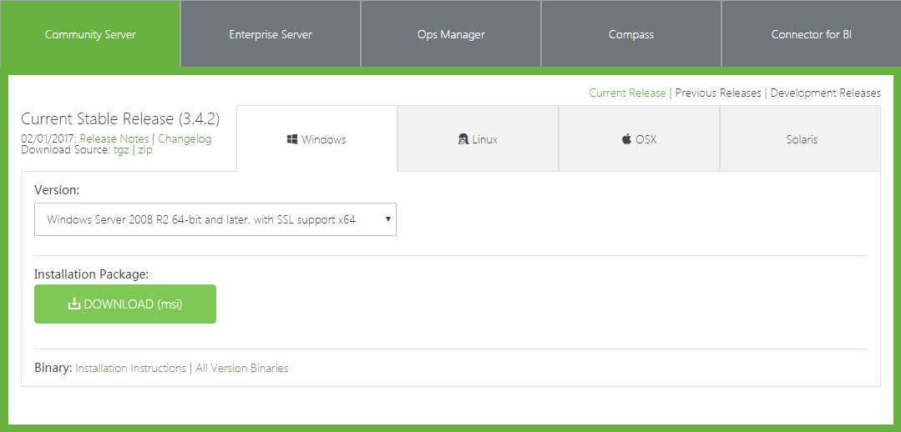
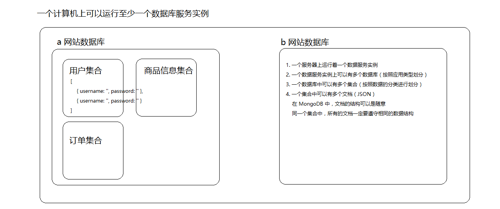

## 相关网址
MongoDB官网:https://www.mongodb.com/
下载地址:https://www.mongodb.com/download-center?jmp=nav#community
菜鸟教程：http://www.runoob.com/mongodb/mongodb-tutorial.html

## 为什么选择MongoDB?
1.只要会js/json就会mongodb(学习成本低)
2.mongodb对js的兼容性最好
3.mongodb存数据就是存json

<!--more-->

## 安装与配置 MongoDB 数据库环境
### 安装mongodb
在官网下载，直接安装即可，默认下一步直到完成


### 验证安装成功：
在cmd终端中输入： `mongo --version` 或是 `mongod --version` ,能看到版本好,说明安装成功
如果终端中输入 mongo --version 提示找不到命令,一定要看看是不是没有配置mongodb的环境变量,并且配置环境变量之后一定要记得重启cmd
### 配置环境变量
我的电脑右键-->属性-->高级系统设置-->环境变量-->系统变量-->path
添加mongodb的安装目录的bin目录到最后即可
	
### window7安装MongoDB存在的问题
建议:升级到window10
解决步骤:
1. 将你的操作系统升级到window7最新版
2. 安装 vc_redist.x64.exe 
3. 如果你的电脑是32位的,再安装32位的mongodb软件 mongodb-win32-i386-3.2.11-signed.msi

### mongodb配置

#### 创建数据目录(必须)
我们在安装完成MongoDB后需要创建一个存放数据的目录。请注意，数据目录应该放在根目录下（(如： C:\ 或者 D:\ 等 ),数据目录的命名随意,比如我就命名 mongodb_datas

#### 启动服务器(必须)
1. 启动MongoDB服务器的方式一：通过终端指令去启动
	+ 首先在终端切换到你的MongoDB的安装目录的bin目录下(当然如果配置了环境变量在哪个目录下都可以了)
	+ 在终端执行: mongod.exe --dbpath c:\mongodb_datas ,如果成功启动就表示一切都OK了
	+ 注意点:
		- 32位版本使用下面的命令启动数据服务：
		```bash
		mongod --dbpath 数据存储路径 --journal --storageEngine=mmapv1
		```
		
		- 执行完上面的命令并成功开启 MongoDB 数据服务实例之后，就把该控制台最小化到一边就可以了，
		- 千万不要关闭，否则无法连接，如果对数据库的操作结束，可以打开该控制台通过 `Ctrl + C` 关闭。
		
2. 启动MongoDB服务器的方式二:方式一的延续,把上面的指令做成一个批处理文件.bat
	新建一个文本文件修改后缀为`.bat`，以记事本的方式打开，输入`mongod.exe --dbpath c:\mongodb_datas`
	
3. 启动MongoDB服务器的方式三:将MongoDB服务器作为Windows服务运行
	以**管理员的身份**打开命令行输入下面的
	
	```bash
	mongod.exe --bind_ip 127.0.0.1 --logpath "C:/mongodb_datas/server_log/mongodb.log" --logappend --dbpath "c:/mongodb_datas" --port 27017 --serviceName "MongoDBServer" --serviceDisplayName "MongoDBServerDisplayName" --install
	```

4. 补充:从Windows服务中卸载 MongoDB 服务
	1. 先停止要删除的服务(比如MongoDBServer)
	2. 以管理员身份运行cmd,在cmd中输入: sc delete 服务名称(比如MongoDBServer)
	3. 千万不要删错了，不然你的系统可能就挂了

5. 注意点:
	1. mongodb.log 这个日志文件一定要先创建好,才能执行指令
	2. 必须要以管理员的身份打开cmd窗口,并运行

### MongoDB 数据库存储结构



和Excel对比一下即可明

| Excel                   | MongoDB            |
| ----------------------- | ------------------ |
| 创建工作簿              | 创建数据库         |
| 创建一个sheet(工作表单) | 创建集合           |
| 确立表头,插入数据       | 插入文档(确立表头) |

核心思想:
	1. 分门别类的存储数据
	2. mongodb是以`集合`的概念来区分不同数据的,比如用户集合,商品集合,订单集合等等,不同的数据要放在不同的集合中去统一管理
	3. 集合里面存储的可以认为是一个数组
	4. 数组中的每一个对象,可以认为就是JSON对象,在mongodb中我们称之为 `文档`
	5. 文档的结构可以随意,但是必须统一,也就是说,同一个集合中,所有的文档一定要遵守相同的数据结构
其他:
	`集合`的作用就是用来隔离数据,分门别类的存储数据

### 操作MongoDB的步骤
1.创建数据库中数据的存储目录
2.启动MongoDB的服务实例
3.创建数据库
4.创建集合
5.创建文档

### 如何连接到MongoDB服务器并且操作它？
**注意：在进行连接之前请确保你的服务实例是开启状态的（不要关闭刚才开启的数据服务实例）。**

可以使用两种方式来连接到MongoDB服务器并且操作它

1. 连接方式1:使用MongoDB自带的MongoDB后台管理 Shell
		在终端中输入 `mongo` 或是 `mongo --host 127.0.0.1 --port 27017`

		mongo 命令默认去连接本机上的 MongoDB 服务实例：`127.0.0.1:27017`，可以通过下面的命令
		指定连接的主机名和端口号：
		```bash
		mongo --host 127.0.0.1 --port 27017
		```

		如果看到类似于如下的字样说明连接成功：
		```bash
		MongoDB shell version v3.4.2
		connecting to: mongodb://127.0.0.1:27017
		MongoDB server version: 3.4.2
		Server has startup warnings:
		2017-01-18T18:49:53.865+0800 I CONTROL  [initandlisten]
		2017-01-18T18:49:53.865+0800 I CONTROL  [initandlisten] ** WARNING: Access control is not enabled for the database.
		2017-01-18T18:49:53.866+0800 I CONTROL  [initandlisten] **          Read and write access to data and configuration is unrestricted.
		2017-01-18T18:49:53.866+0800 I CONTROL  [initandlisten]
		>
		```
		如果提示 “无法连接主机”，请检查你的 MongoDB 数据服务实例是否开启。

2. 操作方式1:在终端中使用mongodb的指令进行操作

	常见指令：见下一个知识点


3. 连接及操作方式2:使用图形化客户端工具：
	robomongo(跨平台) : https://robomongo.org/download

### 基本操作命令

可以参考:
	http://www.yiibai.com/mongodb/mongodb_create_collection.html
	http://www.runoob.com/mongodb/mongodb-tutorial.html

- `show dbs`
  + 查看当前服务实例上所有的数据库
- `use 数据库名称`
  + 如果数据库不存在，则创建数据库，否则切换到指定数据库。
- `db.dropDatabase()`
  + 删除数据库,注意,要在切换的数据库中删除
- `db`
  + 查看当前所处的数据库
- `show collections`
  + 查看当前数据库中所有的集合
- `db.createCollection("集合名称")`
  + 创建集合
- `db.集合名称.drop()`
  + 删除集合
- `db.集合名称.insert({数据文档})`
  + 插入的每一条文档会自动帮我们生成一个`_id`字段,它是mongodb自动维护的,不需要我们关心
- `db.集合名称.find()`
  + 查询指定集合中所有的数据
  + 可以通过 `db.集合名称.find().pretty()` 美化输出格式
  + 默认是查询所有，可以通过：`db.集合名称.find({查询条件})` 按条件查询集合中的数据
  + 模糊查询的条件 {要查询的字段:{$regex: '关键字'}}
- `db.集合名称.update({更新条件}, {要更新的字段})`
  + 更新指定集合数据,注意点,要更新的字段一定要这样写 {$set:{字段的名称:字段的值}},
- `db.集合名称.remove({删除条件})`
  + 删除指定集合中的数据
- `exit` 退出当前操作
- `cls` 清屏

注意点：更新和删除时一般都需要带条件，除非是全部更新与全部删除，不过全部更新与全部删除这样很危险,实际操作过程中很少

### 使用 Node 操作 MongoDB

安装 [MongoDB](https://www.mongodb.com/) 官方提供的驱动包：
```bash
npm install --save mongodb
```

具体操作方式请参考官方文档：https://www.npmjs.com/package/mongodb