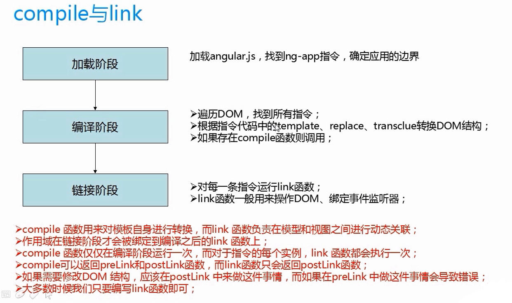
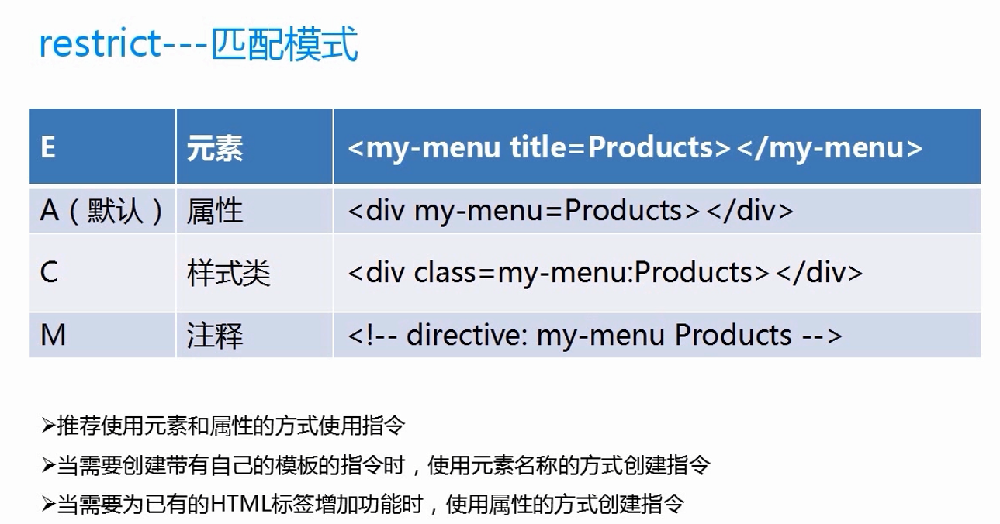
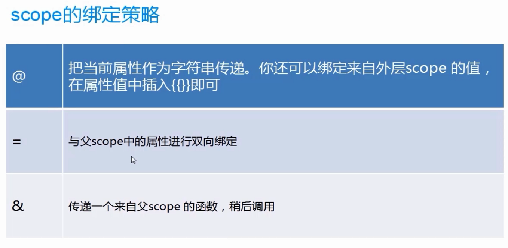
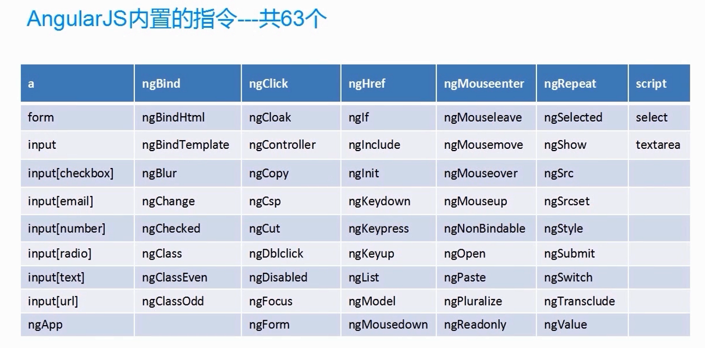
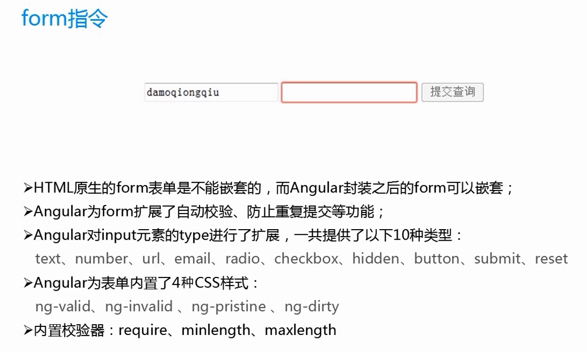
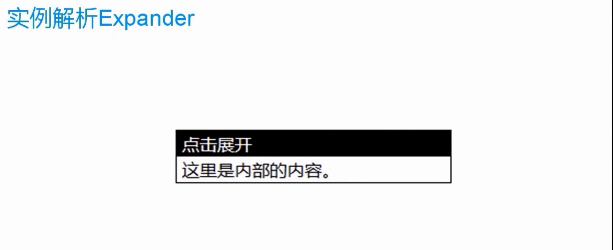
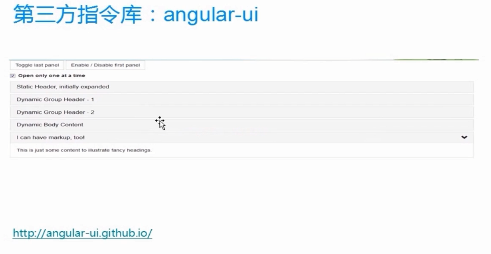

## angular  directive

什么是指令呢？我们先看官方的说法

##### What are Directives?

At a high level, directives are markers on a DOM element (such as an attribute, element name, comment or CSS class) that tell AngularJS's **HTML compiler** ([`$compile`](https://docs.angularjs.org/api/ng/service/$compile)) to attach a specified behavior to that DOM element (e.g. via event listeners), or even to transform the DOM element and its children.

AngularJS comes with a set of these directives built-in, like `ngBind`, `ngModel`, and `ngClass`. Much like you create controllers and services, you can create your own directives for AngularJS to use. When AngularJS [bootstraps](https://docs.angularjs.org/guide/bootstrap) your application, the [HTML compiler](https://docs.angularjs.org/guide/compiler) traverses the DOM matching directives against the DOM elements.

<!-- more -->

在高的层面上讲，指令是DOM元素中的标记(例如一个属性，一个节点名，注释或者CSS类)，它告诉angularjs编译器去给这个元素附加一个指令的行为或者转换DOM元素和它的子元素。

Angularjs拥有一些内建的指令，像ngBind、ngModel和ngClass。非常类似于你创建自己的controller和service，你可以创建你自己的指令个angularjs使用，当angular初始化启动你的应用程序，html编译器将遍历你的DOM元素并且去匹配指令。


实例解析expander

实例解析accordion

指令的运行原理 compile和link




restrict匹配模式

A 属性 	`<div hello></div>`

E element 元素  ` <hello></hello>`

M 注释	

`<!-- directive:hello -->`  要加空格

`<div></div>`

C 样式类  ` <div class="hello"></div>`

```html
<!doctype html>
<html ng-app="MyModule">
	<head>
		<meta charset="utf-8">
	</head>
	<body>
		<hello></hello>
		<div hello></div>
		<div class="hello"></div>
		<!-- directive:hello -->
		<div></div>
	</body>
	<script src="framework/angular-1.3.0.14/angular.js"></script>
	<script src="HelloAngular_Directive.js"></script>
</html>
```

```javascript
var myModule = angular.module("MyModule", []);
myModule.directive("hello", function() {
    return {
        restrict: 'AEMC',
        template: '<div>Hi everyone!</div>',
        replace: true
    }
});
```





`templateUrl`:模板

```javascript
var myModule = angular.module("MyModule", []);

//注射器加载完所有模块时，此方法执行一次
myModule.run(function($templateCache){
  //把内容缓存起来
	$templateCache.put("hello.html","<div>Hello everyone!!!!!!</div>");
});

myModule.directive("hello", function($templateCache) {
    return {
        restrict: 'AECM',
      //把缓存取出来
        template: $templateCache.get("hello.html"),
        replace: true
    }
});

```


`replace`开启的话，就会把我们模板里面的内容替换掉

```html

<!doctype html>
<html ng-app="MyModule">
	<head>
		<meta charset="utf-8">
	</head>
	<body>
		<hello>
          //当我们的页面启动后就会把这段内容替换掉
			<div>这里是指令内部的内容。</div>
		</hello>
	</body>
	<script src="framework/angular-1.3.0.14/angular.js"></script>
	<script src="replace.js"></script>
</html>
```

```javascript
var myModule = angular.module("MyModule", []);
myModule.directive("hello", function() {
    return {
    	restrict:"AE",
    	template:"<div>Hello everyone!</div>",
    	replace:true
    } 
});
```


`ng-transclude`只有这个指令可以使用多个多个指令之前多层嵌套，所以很重要

```html
<!doctype html>
<html ng-app="MyModule">
	<head>
		<meta charset="utf-8">
	</head>
	<body>
		<hello>
			<div>这里是指令内部的内容。</div>
		</hello>
	</body>
	<script src="framework/angular-1.3.0.14/angular.js"></script>
	<script src="transclude.js"></script>
</html>
```

```javascript
var myModule = angular.module("MyModule", []);
myModule.directive("hello", function() {
    return {
    	restrict:"AE",
    	transclude:true,
    	// ng-transclude告诉angular被替换的内容填充到哪里去
    	template:"<div>Hello everyone!<div ng-transclude></div></div>"
    } 
});
```


`link`取属性的方式添加监听事件，以及实现指令与多个控制器之间进行交互

```html
<!doctype html>
<html ng-app="MyModule">
	<head>
		<meta charset="utf-8">
	</head>
	<body>
		<div ng-controller="MyCtrl">
			<loader howToLoad="loadData()">滑动加载</loader>
		</div>
		<div ng-controller="MyCtrl2">
          //定义属性这样让我们的directive去调用
			<loader howToLoad="loadData2()">滑动加载</loader>
		</div>
	</body>
	<script src="framework/angular-1.3.0.14/angular.js"></script>
	<script src="Directive&Controller.js"></script>
</html>
```

```javascript
var myModule = angular.module("MyModule", []);
myModule.controller('MyCtrl', ['$scope', function($scope){
	$scope.loadData=function(){
		console.log("加载数据中...");
    }
}]);
myModule.controller('MyCtrl2', ['$scope', function($scope){
    $scope.loadData2=function(){
        console.log("加载数据中...22222");
    }
}]);
myModule.directive("loader", function() {
    return {
    	restrict:"AE",
    	link:function(scope,element,attrs){
          //这里和jquery一样，给这个loader directive元素添加一个mouseenter事件，然后去调用上面的函数
    		element.bind('mouseenter', function(event) {
    			//scope.loadData();
              //强制刷新以及调用上面的函数
    			// scope.$apply("loadData()");
    			// 注意这里的坑，howToLoad会被转换成小写的howtoload
                //给我们的页面上的指令加了属性，然后通过不同的属性来调用不同函数，这样子也实现了指令的				//复用，指令就是为了复用，就可以在不同的控制器中去复用指令，以及实现数据交互
    			scope.$apply(attrs.howtoload);
    		});
        }
    } 
});
```


### `link`实现多个指令之间的通信

```html
<!doctype html>
<html ng-app="MyModule">

<head>
    <meta charset="utf-8">
    <link rel="stylesheet" href="css/bootstrap-3.0.0/css/bootstrap.css">
    <script src="framework/angular-1.3.0.14/angular.js"></script>
    <script src="Directive&Directive.js"></script>
</head>

<body>
	<div class="row">
		<div class="col-md-3">
			<superman strength>动感超人---力量</superman>
		</div>
	</div>
	<div class="row">
		<div class="col-md-3">
			<superman strength speed>动感超人2---力量+敏捷</superman>
		</div>
	</div>
	<div class="row">
		<div class="col-md-3">
			<superman strength speed light>动感超人3---力量+敏捷+发光</superman>
		</div>
	</div>
</body>

</html>

```

```javascript
var myModule = angular.module("MyModule", []);
myModule.directive("superman", function() {
    return {
      //创建独立作用域，下面一个例子会讲解独立scope
        scope: {},
        restrict: 'AE',
      //指令内部的controller，作用是我们的指令暴露出public方法供外部使用
        controller: function($scope) {
            $scope.abilities = [];
            this.addStrength = function() {
                $scope.abilities.push("strength");
            };
            this.addSpeed = function() {
                $scope.abilities.push("speed");
            };
            this.addLight = function() {
                $scope.abilities.push("light");
            };
        },
      //link是指令内部的一些方法
        link: function(scope, element, attrs) {
          //给我们的元素增加classname
            element.addClass('btn btn-primary');
          //绑定事件
            element.bind("mouseenter", function() {
                console.log(scope.abilities);
            });
        }
    }
});
myModule.directive("strength", function() {
    return {
      //require是说strength指令依赖于superman这个指令
        require: '^superman',
      //当有了依赖之后，我们就可以注入第四个参数了，这样子我们就可以访问到supermanCtrl里面暴露出来的公用方法了
        link: function(scope, element, attrs, supermanCtrl) {
            supermanCtrl.addStrength();
        }
    }
});
myModule.directive("speed", function() {
    return {
        require: '^superman',
        link: function(scope, element, attrs, supermanCtrl) {
            supermanCtrl.addSpeed();
        }
    }
});
myModule.directive("light", function() {
    return {
        require: '^superman',
        link: function(scope, element, attrs, supermanCtrl) {
            supermanCtrl.addLight();
        }
    }
});
```


### 独立scpe

```html
<!doctype html>
<html ng-app="MyModule">
	<head>
		<meta charset="utf-8">
		<link rel="stylesheet" href="css/bootstrap-3.0.0/css/bootstrap.css">
	</head>
	<body>
		<hello></hello>
		<hello></hello>
		<hello></hello>
		<hello></hello>
	</body>
	<script src="framework/angular-1.3.0.14/angular.js"></script>
	<script src="IsolateScope.js"></script>
</html>
```

```javascript
var myModule = angular.module("MyModule", []);
myModule.directive("hello", function() {
    return {
        restrict: 'AE',
       // scope:{},// 如果不加这个参数的话，我们页面中所有的指令都会同时发生改变互相影响，这显然是不是我们想要的
        template: '<div><input type="text" ng-model="userName"/>{{userName}}</div>',
        replace: true
    }
});
```


### scope绑定策略



@绑定

```html
<!doctype html>
<html ng-app="MyModule">
	<head>
		<meta charset="utf-8">
		<link rel="stylesheet" href="css/bootstrap-3.0.0/css/bootstrap.css">
	</head>
	<body>
		<div ng-controller="MyCtrl">
          //需要注意的是@绑定传递的是字符串，而不是对象
			<drink flavor="{{ctrlFlavor}}"></drink>
		</div>
	</body>
	<script src="framework/angular-1.3.0.14/angular.js"></script>
	<script src="ScopeAt.js"></script>
</html>
```

```javascript
var myModule = angular.module("MyModule", []);
myModule.controller('MyCtrl', ['$scope', function($scope){
  //控制器上面加个一个属性
	$scope.ctrlFlavor="百威";
}])
myModule.directive("drink", function() {
    return {
    	restrict:'AE',
        scope:{
          //而这种方式angular则会帮我们自动绑定数据
        	flavor:'@'
        },
        template:"<div>{{flavor}}</div>"
        // ,
      //下面这种方式指定我们的flavor的数据是我们的控制器中的数据
        // link:function(scope,element,attrs){
        // 	scope.flavor=attrs.flavor;
        // }
    }
});
```


ScopeEqual绑定 进行双向数据绑定，也就是我们控制器与指令之间进行双向的数据绑定

```html
<!doctype html>
<html ng-app="MyModule">
	<head>
		<meta charset="utf-8">
		<link rel="stylesheet" href="css/bootstrap-3.0.0/css/bootstrap.css">
	</head>
	<body>
		<div ng-controller="MyCtrl">
			Ctrl:
			<br>
          //这儿是我们控制器中的ctrlFlavor
			<input type="text" ng-model="ctrlFlavor">
			<br>
			Directive:
			<br>
          //这儿展示我们指令中的flavor
			<drink flavor="ctrlFlavor"></drink>
		</div>
	</body>
	<script src="framework/angular-1.3.0.14/angular.js"></script>
	<script src="ScopeEqual.js"></script>
</html>
```

```javascript
var myModule = angular.module("MyModule", []);
myModule.controller('MyCtrl', ['$scope', function($scope){
	$scope.ctrlFlavor="百威";
}])
myModule.directive("drink", function() {
    return {
    	restrict:'AE',
        scope:{
          //用=绑定就可以只要改变我们指令中的flavor就可以改变我们的控制器中的ctrlFlavor，反之我们改变控制器中的也可以改变指令中的
        	flavor:'='
        },
        template:'<input type="text" ng-model="flavor"/>'
    }
});
```


&scope  实现控制器与指令之间的交互，比`link`要方便,传递一个来自父scope的函数，稍后调用

```html
<!doctype html>
<html ng-app="MyModule">
	<head>
		<meta charset="utf-8">
		<link rel="stylesheet" href="css/bootstrap-3.0.0/css/bootstrap.css">
	</head>
	<body>
		<div ng-controller="MyCtrl">
          //这里我们传递的参数是对象，跟上面说的@scope不同
			<greeting greet="sayHello(name)"></greeting>
			<greeting greet="sayHello(name)"></greeting>
			<greeting greet="sayHello(name)"></greeting>
		</div>
	</body>
	<script src="framework/angular-1.3.0.14/angular.js"></script>
	<script src="ScopeAnd.js"></script>
</html>
```

```javascript
var myModule = angular.module("MyModule", [] ;
myModule.controller('MyCtrl', ['$scope', function($scope){
  //暴露出一个方法就可以被我们的指令进行调用
	$scope.sayHello=function(name){
		alert("Hello "+name);
	}
}])
myModule.directive("greeting", function() {
    return {
    	restrict:'AE',
        scope:{
        	greet:'&'
        },
      //在下面我们添加一个方法进行调用我们上面的控制器暴露出来的sayHello方法
      //传递参数的形式是对象的形式
        template:'<input type="text" ng-model="userName" /><br/>'+
        		 '<button class="btn btn-default" ng-click="greet({name:userName})">Greeting</button><br/>'
    }
});
```


angular内置指令在我用的1.3.11中共计63个




 ##### form指令




FormBasic

```html
<html ng-app='TestFormModule'>
	<head>
		<meta http-equiv="content-type" content="text/html; charset=utf-8" />
		<script src="framework/angular-1.3.0.14/angular.js"></script>
		<script src="FormBasic.js"></script>
	</head>
	<body>
		<form name="myForm" ng-submit="save()" ng-controller="TestFormModule">
          //required属性就是我们的angular帮我们自动校验
			  <input name="userName" type="text" ng-model="user.userName" required/>
			  <input name="password" type="password" ng-model="user.password" required/>
          //ng-disabled把它绑定到myForm.$invalid上就可以判断我们的按钮是否可用的状态
			  <input type="submit" ng-disabled="myForm.$invalid"/>
		</form>
	</body>
</html>

```

```javascript
var appModule = angular.module('TestFormModule', []);
appModule.controller("TestFormModule",function($scope){
	$scope.user={
		userName:'damoqiongqiu',
		password:''
	};
	$scope.save=function(){
		alert("保存数据!");
	}
});
```

formadv1 下面是复杂一点的表单

```html
<!doctype html>
<html ng-app>
	<head>
		<script src="framework/angular-1.3.0.14/angular.js"></script>
		<script src="FormAdv1.js"></script>
	</head>
	<body>
		<div ng-controller="Controller">
			<form name="form" class="css-form" novalidate>
				Name:
				<input type="text" ng-model="user.name" name="uName" required /><br/>
				E-mail:
				<input type="email" ng-model="user.email" name="uEmail" required /><br/>
              //校验我们的Email是否合法form.uEmail.$dirty && form.uEmail.$invalid
				<div ng-show="form.uEmail.$dirty && form.uEmail.$invalid">
					Invalid:
					<span ng-show="form.uEmail.$error.required">Tell us your email.</span>
					<span ng-show="form.uEmail.$error.email">This is not a valid email.</span>
				</div>
				Gender:<br/>
				<input type="radio" ng-model="user.gender" value="male" />
				male
				<input type="radio" ng-model="user.gender" value="female" />
				female<br/>
				<input type="checkbox" ng-model="user.agree" name="userAgree" required />
				I agree:
				<input ng-show="user.agree" type="text" ng-model="user.agreeSign" required />
				<div ng-show="!user.agree || !user.agreeSign">
					Please agree and sign.
				</div>
				<br/>
				<button ng-click="reset()" ng-disabled="isUnchanged(user)">
					RESET
				</button>
				<button ng-click="update(user)" ng-disabled="form.$invalid || isUnchanged(user)">
					SAVE
				</button>
			</form>
		</div>
	</body>
</html>

```

```javascript
function Controller($scope) {
	$scope.master = {};

	$scope.update = function(user) {
		$scope.master = angular.copy(user);
	};

	$scope.reset = function() {
		$scope.user = angular.copy($scope.master);
	};

	$scope.isUnchanged = function(user) {
		return angular.equals(user, $scope.master);
	};

	$scope.reset();
}
```

下面说一个比较酷的功能

```html
<!doctype html>
<html ng-app="form-example2">
	<head>
		<link href="../bootstrap/css/bootstrap.min.css" rel="stylesheet" media="screen">
		<script src="framework/angular-1.3.0.14/angular.js"></script>
		<script src="FormCustom.js"></script>
		<style type="text/css">
			div[contentEditable] {
				cursor: pointer;
				background-color: #D0D0D0;
			}
		</style>
	</head>
	<body>
		<div>
          //开启contentEditable可以让我们的div有input的功能
			<div contentEditable="true" ng-model="content" title="Click to edit">Some</div>
			<pre>model = {{content}}</pre>
		</div>
	</body>
</html>

```

```javascript
angular.module('form-example2', []).directive('contenteditable', function() {
	return {
		require : 'ngModel',
		link : function(scope, elm, attrs, ctrl) {
			// view -> model
			elm.bind('keyup', function() {
				scope.$apply(function() {
					ctrl.$setViewValue(elm.text());
				});
			});

			// model -> view
			ctrl.$render = function() {
				elm.html(ctrl.$viewValue);
			};

			// load init value from DOM
			ctrl.$setViewValue(elm.html());
		}
	};
});
```

### 自定义指令



```html
<html ng-app='expanderModule'>
	<head>
		<meta http-equiv="content-type" content="text/html; charset=utf-8" />
		<link rel="stylesheet" type="text/css" href="ExpanderSimple.css"/>
		<script src="framework/angular-1.3.0.14/angular.js"></script>
		<script src="ExpanderSimple.js"></script>
	</head>
	<body>
		<div ng-controller='SomeController'>
			<expander class='expander' expander-title='title'>
				{{text}}
			</expander>
		</div>
	</body>
</html>

```

```javascript
var expanderModule=angular.module('expanderModule', []);
expanderModule.directive('expander', function() {
	return {
      //这里我们的匹配模式定义的是也可以用元素也可以用属性
		restrict : 'EA',
      // 替换
		replace : true,
      //内部的内容是可以变换的
		transclude : true,
		scope : {
          //用=号进行scope双向数据绑定
			title : '=expanderTitle'
		},
      //ng-click="toggle()这里的click只能调用我们内部的toggle
		template : '<div>'
				 + '<div class="title" ng-click="toggle()">{{title}}</div>'
				 + '<div class="body" ng-show="showMe" ng-transclude></div>'
				 + '</div>',
		link : function(scope, element, attrs) {
			scope.showMe = false;
          //这里我们定义的toggle只能在指令内部进行调用
			scope.toggle = function() {
				scope.showMe = !scope.showMe;
			}
		}
	}
});
expanderModule.controller('SomeController',function($scope) {
    $scope.title = '点击展开';
	$scope.text = '这里是内部的内容。';
});

```

```css
.expander {
	border: 1px solid black;
	width: 250px;
}

.expander>.title {
	background-color: black;
	color: white;
	padding: .1em .3em;
	cursor: pointer;
}

.expander>.body {
	padding: .1em .3em;
}
```


再来一个

```html
<html ng-app="expanderModule">
	<head>
		<meta http-equiv="content-type" content="text/html; charset=utf-8" />
		<link rel="stylesheet" type="text/css" href="Accordion.css"/>
		<script src="framework/angular-1.3.0.14/angular.js"></script>
		<script src="Accordion.js"></script>
	</head>
	<body ng-controller='SomeController' >
		<accordion>
			<expander class='expander' ng-repeat='expander in expanders' expander-title='expander.title'>
				{{expander.text}}
			</expander>
		</accordion>
	</body>
</html>
```

```javascript
var expModule=angular.module('expanderModule',[])
expModule.directive('accordion', function() {
	return {
		restrict : 'EA',
		replace : true,
		transclude : true,
		template : '<div ng-transclude></div>',
      //对外暴露方法
		controller : function() {
			var expanders = [];
			this.gotOpened = function(selectedExpander) {
				angular.forEach(expanders, function(expander) {
					if (selectedExpander != expander) {
						expander.showMe = false;
					}
				});
			}
			this.addExpander = function(expander) {
				expanders.push(expander);
			}
		}
	}
});

expModule.directive('expander', function() {
	return {
		restrict : 'EA',
		replace : true,
		transclude : true,
      //依赖于accordion指令
		require : '^?accordion',
		scope : {
			title : '=expanderTitle'
		},
		template : '<div>'
				  + '<div class="title" ng-click="toggle()">{{title}}</div>'
				  + '<div class="body" ng-show="showMe" ng-transclude></div>'
				  + '</div>',
		link : function(scope, element, attrs, accordionController) {
			scope.showMe = false;
			accordionController.addExpander(scope);
			scope.toggle = function toggle() {
				scope.showMe = !scope.showMe;
				accordionController.gotOpened(scope);
			}
		}
	}
});

expModule.controller("SomeController",function($scope) {
	$scope.expanders = [{
		title : 'Click me to expand',
		text : 'Hi there folks, I am the content that was hidden but is now shown.'
	}, {
		title : 'Click this',
		text : 'I am even better text than you have seen previously'
	}, {
		title : 'Test',
		text : 'test'
	}];
});

```

```css
.expander {
	border: 1px solid black;
	width: 250px;
}

.expander>.title {
	background-color: black;
	color: white;
	padding: .1em .3em;
	cursor: pointer;
}

.expander>.body {
	padding: .1em .3em;
}
```

看到没，其实编写自定义指令还是比较困难的，所以我们可以去引入一些第三方的指令库



这样子，就可以极大地方便实现我们想要的功能了

再来个难一点的自定义指令

```html
<!doctype html>
<html ng-app="MyModule">

<head>
    <meta charset="utf-8">
    <link rel="stylesheet" href="framework/bootstrap-3.0.0/css/bootstrap.css">
    <link rel="stylesheet" href="common.css">
    <script src="framework/angular-1.3.0.14/angular.js"></script>
    <script src="framework/ui-bootstrap-tpls-0.11.0.js"></script>
    <script src="Accordion-ngui.js"></script>
</head>

<body>
    <div class="container">
        <div class="row">
            <div class="col-md-12">
                <div ng-controller="AccordionDemoCtrl">
                    <p>
                        <button class="btn btn-default btn-md" ng-click="status.open = !status.open">Toggle last panel</button>
                        <button class="btn btn-default btn-md" ng-click="status.isFirstDisabled = ! status.isFirstDisabled">Enable / Disable first panel</button>
                    </p>

                    <label class="checkbox">
                        <input type="checkbox" ng-model="oneAtATime">Open only one at a time
                    </label>
                    <accordion close-others="oneAtATime">
                        <accordion-group heading="Static Header, initially expanded" is-open="status.isFirstOpen" is-disabled="status.isFirstDisabled">
                            This content is straight in the template.
                        </accordion-group>
                        <accordion-group heading="{{group.title}}" ng-repeat="group in groups">
                            {{group.content}}
                        </accordion-group>
                        <accordion-group heading="Dynamic Body Content">
                            <p>The body of the accordion group grows to fit the contents</p>
                            <button class="btn btn-default btn-md" ng-click="addItem()">Add Item</button>
                            <div ng-repeat="item in items">{{item}}</div>
                        </accordion-group>
                        <accordion-group is-open="status.open">
                            <accordion-heading>
                                I can have markup, too! <i class="pull-right glyphicon" ng-class="{'glyphicon-chevron-down': status.open, 'glyphicon-chevron-right': !status.open}"></i>
                            </accordion-heading>
                            This is just some content to illustrate fancy headings.
                        </accordion-group>
                    </accordion>
                </div>

            </div>
        </div>
    </div>

</body>

</html>
```

```javascript
var myModule = angular.module('MyModule', ['ui.bootstrap']);
myModule.controller('AccordionDemoCtrl', ['$scope',
    function($scope) {

        $scope.oneAtATime = true;

        $scope.groups = [{
            title: 'Dynamic Group Header - 1',
            content: 'Dynamic Group Body - 1'
        }, {
            title: 'Dynamic Group Header - 2',
            content: 'Dynamic Group Body - 2'
        }];

        $scope.items = ['Item 1', 'Item 2', 'Item 3'];

        $scope.addItem = function() {
            var newItemNo = $scope.items.length + 1;
            $scope.items.push('Item ' + newItemNo);
        };

        $scope.status = {
            isFirstOpen: true,
            isFirstDisabled: false
        };
    }
])

```

