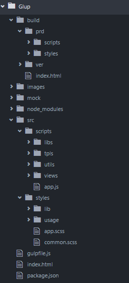
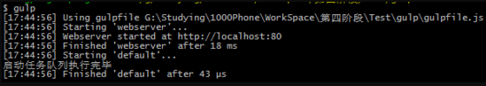
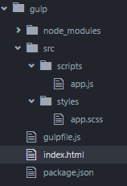
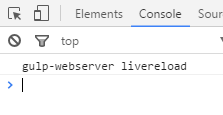

原文  http://chping.website/2016/10/18/gulp和webpack对比/

在现在的前端开发中，前后端分离、模块化开发、版本控制、文件合并与压缩、mock数据等等一些原本后端的思想开始逐渐渗透到“大前端”的开发中。前端开发过程越来越繁琐，当今越来越多的网站已经从网页模式进化到了 Webapp 模式。它们运行在现代的高级浏览器里，使用 HTML5、 CSS3、 ES6 等更新的技术来开发丰富的功能，网页已经不仅仅是完成浏览的基本需求，并且Webapp通常是一个单页面应用(SPA)，每一个视图通过异步的方式加载，这导致页面初始化和使用过程中会加载越来越多的 JavaScript 代码，这给前端开发的流程和资源组织带来了巨大的挑战。

<!--more-->

前端开发和其他开发工作的主要区别，首先是前端是基于多语言、多层次的编码和组织工作，其次前端产品的交付是基于浏览器，这些资源是通过增量加载的方式运行到浏览器端，如何在开发环境组织好这些碎片化的代码和资源，并且保证他们在浏览器端快速、优雅的加载和更新，就需要一个模块化系统，这个理想中的模块化系统是前端工程师多年来一直探索的难题。

本文需要有一定的 [Gulp](http://www.ydcss.com/archives/18) 和 [Webpack](http://www.jianshu.com/p/42e11515c10f) 的基本概念，对Gulp和Webpack的使用有一定的了解。

同时还需要对npm或者cnpm有一定的的了解，对ComonJS、AMD规范有一定的的了解。

## Gulp

[Gulp](https://github.com/gulpjs/gulp) 就是为了规范前端开发流程，实现前后端分离、模块化开发、版本控制、文件合并与压缩、mock数据等功能的一个前端自动化构建工具。说的形象点，“Gulp就像是一个产品的流水线，整个产品从无到有，都要受流水线的控制，在流水线上我们可以对产品进行管理。”

另外，Gulp是通过task对整个开发过程进行构建。

## Webpack

[Webpack](https://github.com/webpack/webpack) 是当下最热门的前端资源模块化管理和打包工具。它可以将许多松散的模块按照依赖和规则打包成符合生产环境部署的前端资源。还可以将按需加载的模块进行代码分隔，等到实际需要的时候再异步加载。通过 loader的转换，任何形式的资源都可以视作模块，比如 CommonJs 模块、AMD 模块、ES6 模块、CSS、图片、JSON、Coffeescript、LESS 等。

## Gulp和Webpack功能实现对比

简单介绍了一下Gulp和Webpack的概念性的问题和大环境，接下来进入本文的主题，对比一下Gulp和Webpack的优缺点。将从基本概念、启动本地Server、sass/less预编译、模块化开发、文件合并与压缩、mock数据、版本控制、组件控制八个方面对Gulp和Webpack进行对比。

## 基本概念

首先从概念上，我们可以清楚的看出，Gulp和Webpack的侧重点是不同的。

Gulp侧重于前端开发的 **整个过程** 的控制管理（像是流水线），我们可以通过给gulp配置不通的task（通过Gulp中的gulp.task()方法配置，比如启动server、sass/less预编译、文件的合并压缩等等）来让gulp实现不同的功能，从而构建整个前端开发流程。

Webpack有人也称之为 **模块打包机** ，由此也可以看出Webpack更侧重于模块打包，当然我们可以把开发中的所有资源（图片、js文件、css文件等）都可以看成模块，最初Webpack本身就是为前端JS代码打包而设计的，后来被扩展到其他资源的打包处理。Webpack是通过loader（加载器）和plugins（插件）对资源进行处理的。

另外我们知道Gulp是对整个过程进行控制，所以在其配置文件（gulpfile.js）中配置的每一个task对项目中 **该task配置路径下所有的资源** 都可以管理。

比如，对sass文件进行预编译的task可以对其配置路径下的所有sass文件进行预编译处理：
```javascript
gulp.task('sass',function(){
 gulp.src('src/styles/*.scss')
 .pipe(sass().on('error',sass.logError))
 .pipe(gulp.dest('./build/prd/styles/'));//编译后的输出路径
});
```

上面这个task可以对 `'src/styles/*.scss'` 目录下的所有以 `.scss` 结尾的文件进行预处理。

Webpack则不是这样管理资源的，它是根据模块的 **依赖关系** 进行静态分析，然后将这些模块按照指定的规则生成对应的静态资源(如下图)。


通俗的说，Webpack就是需要通过其配置文件（webpack.config.js）中 `entry` 配置的一个入口文件（JS文件）,如下图
```javascript
entry: {
 app:__dirname + "/src/scripts/app.js",
}
```

然后Webpack进入该 `app.js` 文件进行解析， `app.js` 文件如下图：
```javascript
//引入scss文件
import'../style/app.scss';

//引入依赖模块
vargreeter =require('./Greeter.js');
document.getElementById('root').appendChild(greeter());
```

解析过程中，发现一个 `app.scss` 文件，然后根据 `webpack.config.js` 配置文件中的 `module.loaders` 属性去查找处理 `.scss` 文件的loader进行处理，处理 `app.scss` 文件过程中，如果发现该文件还有其他依赖文件，则继续处理 `app.scss` 文件的依赖文件，直至处理完成该“链路”上的依赖文件，然后又遇到一个 `Greeter.js` 模块，于是像之前一样继续去查找对应的loader去处理…

所以，Webpack中对资源文件的处理是通过入口文件产生的依赖形成的，不会像Gulp那样，配置好路径后，该路径下所有规定的文件都会受影响。

## 模块化开发

所谓的前端模块化开发，我的理解就是，在开发的时候，把不通的资源文件按照他的具体用途进行分类管理，在使用的时候利用CommonJS、AMD、CMD等规范将这些资源文件引入到当前文件中。然后在测试或者最后上线的时候，将这些资源文件按照一定的要求进行压缩合并再加上版本控制处理。

可能这样的理解或者说法值得商榷，但是个人还是觉得模块化就是对内容的管理，是为了解耦合。

首先从Gulp入手，看看在项目中，怎样利用模块化的思想进行开发。下面是一个gulp项目的目录结构：


```bash
Gulp
 |——build: 项目输出路径
 | |——prd: css、js文件输出路径
 | |——scripts: js文件的输出路径
 | |——styles: css文件的输出路径
 | |——ver: 版本号相关文件
 | |——index.html: 编译后的index.html
 |——images: 图片文件夹
 |——mock: mock数据文件夹
 |——node_modules: npm包管理文件夹
 |——src: 工作目录
 | |——scripts
 | |——libs: 第三方依赖库（jQuery等）
 | |——tpls: 模板文件
 | |——utils: 工具类文件夹
 | |——views: 页面自定义js文件
 | |——app.js: index.html文件的入口js
 | |——styles：文件和scripts文件夹下基本一致（本例中我引用了第三方框架，目录更深，不在展示）
 |——gulpfile.js: gulp的配置文件
 |——index.html: 主页html文件
 |——package.json: npm包管理配置文件
```

在实际开发过程中，在src目录下工作，html、js和css等文件通过gulp的task配置，执行合并和压缩后输出到build目录下（下面会详细介绍合并压缩的实现）。在详细一点就是：

1.  创建主页html文件
2.  创建与之对应的app.js入口文件和app.scss入口文件。这两个文件只通过CommonJS规范 **引入各自views文件中自定义的js(或scss)文件** ，具体逻辑不写此文件中。
3.  在views目录下编写js（或css）文件的逻辑代码，其中如果多个文件需要公共逻辑或者工具方法，就可以抽离出来在util文件夹下创建对应的公共方法，然后在views中需要的js（或css）文件中通过CommonJS规范引入使用。libs目录下的第三方库或框架也是这个思想去引用。
4.  scripts目录下的tpls文件是用来放置html模板的，引用方式和引用libs相同。

大体介绍了一下我理解的模块化的思想，但是需要指出的是Gulp对js文件的模块化工作是通过Webpack实现的，具体来说是通过安装 **gulp-webpack** 模块和相关的 **loader** 模块进行js模块化管理的。具体步骤如下：

1.  在项目中通过npm安装一个 **gulp-webpack** 、 **vinyl-named** 、 **imports-loader** 和 **string-loader** 模块(压缩合并模块后面再介绍)
	```bash
    $ npm install gulp-webpack vinyl-named -D
    ```

2.  然后在Gulp的配置文件gulpfile.js中通过CommonJs规范引入gulp-webpack 模块，并进行简单配置
	```javascript
    //1.引入 gulp-webpack和vinyl-named模块
    varwebpack=require('gulp-webpack');
    varwebpack=require('vinyl-named');

    //2.js 模块化配置
    varjsFiles = [
    './src/scripts/*.js',
     ];
     gulp.task('packjs',function(){
     gulp.src(jsFiles)
     .pipe(uglify().on('error',function(err){
    console.log('\x07',err.lineNumber,err.message);
    returnthis.end();
     }))

    //Webpack 对js模块化部分 start
     .pipe(webpack({
     output:{
     filename:'[name].js'
     },
    module:{
     loaders:[{
     test: /\.js$/,
     loader:'imports?define=>false'
     },
     {
     test:/\.string$/,
     loader:'string'
     }
     ]
     }
     }));
    //Webpack 对js模块化部分 end
     .pipe(concat('all.js'))
     .pipe(gulp.dest('./build/prd/scripts/'));
    });
    ```

对css文件我们也采用同js文件一样的模块化思想，利用sass进行模块化开发，至于对scss文件的合并压缩配置，下面还会详细介绍。

接下来应该介绍一下Webpack的模块化实现了，其实也就没什么可以说的了，文件目录和Gulp的基本相同，只不过实现过程中使用到的插件或者说模块不同，配置不同而已。另外需要注意的是，Webpack对于资源文件的模块化打包处理都是按js文件的处理方式处理的，例如还是上一小节中，你可能发现了，我在 `app.js` 入口文件中有这样一行代码
```javascript
import'../style/app.scss';
```

你当时可能产生疑问，为什么在js文件中引入scss文件呢？

这是因为Webpack是通过依赖关系进行文件管理的，所以，想要对样式文件进行模块化管理则必须与 `app.js` 入口文件建立依赖关系，因此我们将样式文件的入口 `app.scss` 文件引入到了 `app.js` 中（其他资源想要被管理，也需要这样与 `app.js` 入口文件建立依赖关系）。

但是这样做很明显的就是样式文件通过 `app.js` 入口文件全部都合并压缩到js文件中了，这很显然不是我们想要的结果，所以我们需要将样式文件从js文件中剥离出来。

1.  在项目中通过npm安装一个 **extract-text-webpack-plugin** 的模块
	```javascript
    $ npm install extract-text-webpack-plugin -D
    ```

2.  然后在Webpack的配置文件webpack.config.js中进行简单配置
	```javascript
    //1.引入extract-text-webpack-plugin模块
    varEt =require('extract-text-webpack-plugin');

    module.exports = {
    //source-map调试
     devtool: 'eval-source-map',
    //webpack入口文件配置
     entry: {
     app:__dirname + "/src/scripts/app.js",
     },
    //webpack出口文件配置
     output: {
     path: __dirname + "/prd/scripts/",//输出文件路径配置
     filename: "bundle.js"//输出文件名配置
     },
    module:{
     loaders:[
     {
     test: /\.scss$/,
     loader: Et.extract('style','css!sass')//从js中抽离scss文件
     }
     ]
     },
     plugins: [
    newEt('./styles/bundle.css'),//从js中抽离scss文件输出目录设置
     ],
    //本地server配置
     devServer: {
     contentBase: __dirname + '/prd/',//本地服务器所加载的页面所在的目录
     port:8089,//本地服务端口配置
     colors: true,//终端中输出结果为彩色
     historyApiFallback: true,//不跳转
     inline: true//实时刷新
     }
    }
    ```

上面有些配置信息并不完全，下面的小节中会逐渐介绍到。这样我们就实现了将css文件从js文件中剥离出来的目的。Webpack不但可以对css文件可以进行模块化管理，还可以对图片进行模块管理，有兴趣的可以自己去尝试一下。

## 文件合并与压缩

上面的模块化中，我们提到了模块化其实很大一部分是在做文件的合并与压缩操作，所以我们马上来看看Gulp和Webpack是怎样是想文件的合并和压缩的。

先来看看大背景，由于现在前端越来越庞大，页面文件依赖也越来越多，所以对这些文件进行合理的合并和压缩就志在必得。根据前面的了解，Webpack应该比Gulp更擅长文件合并和压缩，毕竟人家被称为 **模块打包机** 吗。

结论是正确的，Gulp可以对css文件以及js文件进行合并压缩处理，而Webpack可以实现对css文件，js文件，html文件等进行合并压缩和图片的压缩，还可以对js文件进行编译（如es6–>es5，react jsx）等等，这些都是通过Webpack的 **loader** 实现的，当然这些也可以加入到Gulp中，毕竟Gulp把Webpack当做一个模块，通过 **gulp-webpack** 都引入了。

### Gulp合并压缩文件

#### css的压缩

要想实现Gulp对css文件的压缩只需要安装一个 **gulp-minify-css** 模块即可。

1.  在项目中通过npm安装一个 **gulp-minify-css** 的模块
	```javascript
    $ npm install gulp-minify-css -D
    ```

2.  然后在Gulp的配置文件gulpfile.js中通过CommonJs规范引入gulp-minify-css模块，并进行简单配置
	```javascript
    //1.引入 gulp-minify-css模块
    varminifyCSS =require('gulp-minify-css');

    //2.css 预处理
    varcssFiles = [
    './src/styles/usage/page/index.scss'
    ]
    gulp.task('sass',function(){
     gulp.src(cssFiles)
     .pipe(sass().on('error',sass.logError))
     .pipe(minifyCSS())//执行压缩处理在一行
     .pipe(gulp.dest('./build/prd/styles/'));
    });
    ```

这样一个简单的css压缩就实现了。

#### js合并压缩

要想实现Gulp对js文件的合并压缩需要安装一个 **gulp-uglify** 和 **gulp-concat** 两个模块，前者是用于压缩的模块，后者是一个合并的模块。

1.  在项目中通过npm安装 **gulp-uglify** 和 **gulp-concat** 模块
	```javascript
    $ npm install gulp-uglify gulp-concat -D
    ```

2.  然后在Gulp的配置文件gulpfile.js中通过CommonJs规范引入 **gulp-uglify** 和 **gulp-concat** 模块，并进行简单配置
	```javascript
    //1.引入**gulp-uglify**和**gulp-concat**模块
    varuglify =require('gulp-uglify');
    varconcat =require('gulp-concat');

    //js 合并压缩
    varjsFiles = [
    './src/scripts/*.js',
     ];
     gulp.task('packjs',function(){
     gulp.src(jsFiles)
    //js文件的压缩
     .pipe(uglify().on('error',function(err){
    console.log('\x07',err.lineNumber,err.message);
    returnthis.end();
     }))
     .pipe(webpack({
     output:{
     filename:'[name].js'
     },
    module:{
     loaders:[{
     test: /\.js$/,
     loader:'imports?define=>false'
     },
     {
     test:/\.string$/,
     loader:'string'
     }
     ]
     }
     }));
    //js文件的合并
     .pipe(concat('all.js'))
     .pipe(gulp.dest('./build/prd/scripts/'));
    });
    ```

js的文件合并压缩也完成了。我们再来看一下Webpack的合并压缩。

### Webpack的合并压缩

#### 压缩js和css

针对js和css文件的压缩，Webpack已经内嵌了uglifyJS来完成对js与css的压缩混淆，无需引用额外的插件。我们只需要在Webpack配置文件中的plugins属性中做如下配置：
```javascript
plugins: [
  newwebpack.optimize.UglifyJsPlugin({//压缩代码
   compress: {
     warnings: false
   },
   except: ['$super','/pre>,'exports','require']//排除关键字
  })
]
```

需要注意的是：压缩的时候需要排除一些关键字，不能混淆，比如$或者require，如果混淆的话就会影响到代码的正常运行。

#### html的压缩

想要对html进行压缩，同样也是需要配置Webpack的配置文件，并且需要下载两个插件 **HtmlWebpackPlugin** 和 **html-minifier** 插件：

1.在项目中通过npm安装 **HtmlWebpackPlugin** 和 **html-minifier** 模块
```javascript
$ npm install HtmlWebpackPlugin -D
$ npm install html-minifier -D
```

2.然后在Webpack的配置文件webpack.config.js进行如下配置：
```javascript
plugins: [
  newHtmlWebpackPlugin({//根据模板插入css/js等生成最终HTML
    favicon:'./src/img/favicon.ico',//favicon路径
    filename:'/view/index.html',//生成的html存放路径
    template:'./src/view/index.html',//html模板路径
    inject:true,//允许插件修改哪些内容，包括head与body
    hash:true,//为静态资源生成hash值
    minify:{ //压缩HTML文件
      removeComments:true,//移除HTML中的注释
      collapseWhitespace:true//删除空白符与换行符
    }
  })
]
```

HtmlWebpackPlugin插件在生成HTML时调用了 html-minifier 插件来完成对HTML的压缩，这里我们使用两个配置完成来移除HTML中的注释以及空白符达到压缩的效果。

## sass/less预编译

我们再来看看sass/less预编译，其实就sass/less的预编译来说，两者区别不是很大。Gulp是通过 `gulp-sass` 、 `gulp-less` 模块进行预处理；而Webpack是通过 `scss-loader` 、 `less-loader` 加载器（loader）进行预处理。我们还是分别来看一下两者对此的实现。

### Gulp预编译sass/less

以sass为例子：

1.  在项目中通过npm安装一个 **gulp-sass** 的模块
	```bash
    $ npm install gulp-sass -D
    ```

2.  然后在Gulp的配置文件gulpfile.js中通过CommonJs规范引入gulp-sass模块，并进行简单配置
	```javascript
    //1.引入 gulp-sass模块
    var sass=require('gulp-sass');

    //2.css 预处理
    var cssFiles = [
      './src/styles/usage/page/**/*'
      //./src/styles/usage/page目录下的所有文件
    ];
    gulp.task('sass',function(){
      gulp.src(cssFiles)
       .pipe(sass().on('error',sass.logError))
       .pipe(minifyCSS())
       .pipe(gulp.dest('./build/prd/styles/'));//编译后的输出路径
     });

    //3.对sass文件的修改添加监听事件
    gulp.task('watch',function(){
      gulp.watch('./src/styles/**/*',['sass']);
    });

    gulp.task('default',['watch','webserver'],function(){
      console.log('所有任务队列执行完毕');
    });
    ```

这样，一个简单的sass预处理的task就配置完成了，然后我们还将该task加到gulp.watch()上实现了自动编译（即修改sass文件后保存，则立即执行sass预处理），配合Gulp启动的server则可以实现sass文件修改保存即可在浏览器中查看效果的目的，下一小节会介绍启动本地server。

### Webpack预编译sass/less

同样以sass为例子：

1.  在项目中通过npm安装一个 **sass-loader** 和 **node-sass** 模块，前者是用来加载sass相关文件的，后者是用来编译sass文件的。另外还需要安装另外两个模块 **css-loader** 和 **style-loader** ，前者是用来加载css相关文件的，后者是用来将css样式装填到html中的内联样式。
	```javascript
    $ npm install sass-loader node-sass css-loader style-sass -D
    ```

2.  然后在Webpack的配置文件webpack.config.js中进行简单配置
	```javascript
    module:{
      loaders:[
       {
         test: /\.css$/,//匹配以.css结尾的文件，如果你项目不需要刻意不配置
         loader: 'style!css'//这里顺序必须这样
       },
       {
         test: /\.scss$/,//匹配以.scss结尾的文件
         loader: 'style!css!sass'
       }
     ]
    }
    ```

前面提到过，Webpack是通过文件的依赖关系进行加载分析的，所以当程序从主入口（js文件）进入后，在依赖的资源文件中发现有sass文件后，就会利用我们配置的 **sass-loader** 去加载，然后用 **node-sass** 去解析编译成普通的css语法的样式文件，在然后就是利用 **style-loader** 将样式以内联样式的形式配置到html中（这里有一个问题，就是css-loader有什么用?我也没搞明白，但是不添加会报错，有知道的可以留言交流一下）。这样Webpack就完成了sass的预处理。

## 启动server

我们都知道在前端开发中，ajax请求是需要启动一个server的。特别是在前后端分离思想中，前端开发不再像以前一样过分依赖于后端开发，以前的那种前端测试ajax请求需要装个tomcat或者其它服务器来启动server的现象已经成为过去式，现在我们可以使用像Gulp这类前端自动构建工具启动一个本地server进行测试，再也不收后端程序员钳制了（开个玩笑，和后端好好沟通才能让前端开发更方便）。那么，我们来分别看一下Gulp和Webpack是怎样实现这个功能的。

### Gulp启动server

在Gulp中想要启动一个本地serve，只需要以下几步：

1.  在项目中通过npm安装一个 **gulp-webserver** 的模块
	```bash
    $ npm install gulp-webserver -D
    ```

2.  然后在Gulp的配置文件gulpfile.js中通过CommonJs规范引入gulp-webserver模块，并进行简单配置
	```javascript
    //1.引入 gulp-webserver 模块
    varwebserver =require('gulp-webserver');

    //2.配置server task
    gulp.task('webserver',function(){
      gulp.src('./')
      .pipe(webserver({
        host:'localhost',
        port:80,
        //浏览器自动刷新
        livereload:true,
        //显示文件目录
        directoryListing:{
          enable: true,
          path:'./'
        },
      }));
    });

    //3.配置默认task
    gulp.task('default',['webserver'],function(){
      console.log('启动任务队列执行完毕');
    })
    ```

3.  在命令行中启动server
	```bash
    $ gulp
    ```

启动成功：



1.  在浏览器地址栏中输入 **localhost** 打开页面验证。

经过以上这三步，我们就在Gulp中启动了一个server了。在Gulp中启动本地服务有一个很方便的配置，就是 `livereload:true` 属性的设置，设置后浏览器会根据你项目中资源的变化自动刷新浏览器（如果你的chrome浏览器设置该属性后在你修改文件并保存时仍没有自动刷新，可能是你的chrome浏览器不支持，可以chrome扩展程序中搜索并安装LiveReload插件），比如：

我的gulp测试目录结构：



index.html
```html
<!DOCTYPE html>
<htmllang="en">
  <head>
    <metacharset="UTF-8">
    <title>Document</title>
  </head>
  <body>

    <scriptsrc="/src/scripts/app.js"></script>
  </body>
</html>
```

我在app.js文件中输入以下内容，然后保存。
```javascript
console.log('gulp-webserver livereload');
```

浏览器中控制台上会立刻打印出一下信息：



说明浏览器自动刷新工程，这个小功能在我们开发中屡试不爽。但是，这个功能是需要结合上一小节中的 `gulp.watch()` 实时监控文件变化，然后执行合并压缩和sass/less编译等操作后，浏览器再刷新时才能保证是我们修改后的内容。所以， `livereload:true` 属性只是监控到我们修改文件后刷新浏览器重新请求文件，如果我们不重新编译修改后的文件，浏览器获取到的还是原文件，并不会展示变化。

### Webpack启动server

在Webpack中也可以通过插件的形式安装一个 **webpack-dev-server** 来实现达到启动本地server的目的，具体步骤如下：

1.  在项目中通过npm安装一个 **webpack-dev-server** 的模块
	```bash
    $ npm install -g webpack-dev-server -D
    ```

2.  然后在Webpack的配置文件webpack.config.js中进行简单配置
	```javascript
    module.exports = {
      devtool: 'eval-source-map',
      //webpack入口文件配置
      entry: {
        app:__dirname + "/src/scripts/app.js",
      },
      //webpack出口文件配置
      output: {
        path: __dirname + "/prd/scripts/",//输出文件路径配置
        filename: "bundle.js"//输出文件名配置
      },
      //本地server配置
      devServer: {
        contentBase: __dirname,//本地服务器所加载的页面所在的目录
        port:8089,//本地服务端口配置
        colors: true,//终端中输出结果为彩色
        historyApiFallback: true,//不跳转
        inline: true//实时刷新
      }
    }
    ```

3.  在命令行中启动server
	```bash
    $ webpack-dev-server
    ```

然后你就会看见命令行输出内容很多，只要看看保证没有Error就说明成功了。

1.  在浏览器地址栏中输入 **localhost：8089** 测试一下。

Webpack的启动本地服务也顺利实现了，是不是也想实现像Gulp一样浏览器自动刷新呀？那Webpack能不能实现呢？答案是肯定的，Webpack官方提供了一个辅助开发工具，它可以自动监控项目下的文件，一旦有修改保存操作，开发服务器就会自动运行Webpack 打包命令，帮我们自动将开发的代码重新打包。而且，如果需要的话，还能自动刷新浏览器，重新加载资源。理论上好像是这样，但是实现好像有不少限制，比如，HTML文件的自动刷新问题（html-webpack-plugin插件使用老是报错），当本地server启动在非output.path路径之外时则不能自动刷新等问题，等我再学习学习再说，或者有知道的可以留言讨论。

而这个辅助工具就是 **webpack-dev-server** ，它主要提供两个功能：一是为静态文件提供server服务，二是自动刷新和热替换(HMR)。所以想实现如Gulp一样的功能也是可以的，只需要在 `$ webpack-dev-server` 后面添加 `--inline --hot` 即可。需要注意的是 `--inline` 是自动刷新，同时在第二部中的devServer属性中有一个 **inline:true** 需要配置；而 `--hot` 是热替换（ [详细了解热替换](https://segmentfault.com/a/1190000003872635)、 [了解webpack-dev-server](https://segmentfault.com/a/1190000006964335) 、 [webpack-dev-server](http://www.07net01.com/2015/12/1004731.html) ）。

通过对比来看，好像Webpack的 **webpack-dev-server** 比Gulp的 **gulp-server** 功能要强一些。因为通过上面可以看出 **webpack-dev-server** 有两个大功能：一是为静态文件提供server服务，二是自动刷新（ 自动刷新其实需要两步：1.修改文件后，文件自动编译{包括合并压缩或者语法编译等}，2.刷新浏览器请求最新编译后的文件 ）和热替换(HMR)；而 **gulp-server** 虽然提供了启动本地server的能力和仅自动刷新浏览器的能力，缺少一个文件自动编译的能力，这需要借助其他模块实现（上一小节已介绍，结合gulp.watch()实时监控文件变化，并编译）。

另外需要注意的是，实际开发中发现 **webpack-dev-server** 实现自动刷新的时候，并没有执行自动编译，只是将修改的内容合并压缩等处理后发送给了浏览器，并造成了已经编译的现象，但是通过build/prd/scripts目录下的bundle.js(合并压缩后的输出文件)文件，可以发现内容并没有编译（对于Webpack还是不熟悉，好多问题等待解决）。

## mock数据

在现在前后端分离的思想中，前端和后端耦合度越来越小，现在唯一需要前后端密切联系的就是借口的定义和数据格式的确定。一般在项目开始前，前端和后端将项目中的接口和数据格式全部确定下来（当然项目需求变更就需要临时确立这些共识了），然后前端就可以自己mock数据了。

### Gulp实现mock数据

Gulp中对mock数据的实现使通过NodeJS内置的fs模块和url模块实现的，因为Gulp本身就是基于NodeJS的。还记得第一小节“模块化开发”中目录结构中的那个mock目录吗？那就是用来储存 `.json` 文件的mock数据目录。

1.  配置Gulp的gulpfile.js文件
```javascript
//1.引入 fs 和 url 模块
varfs =require('fs');
varurl =require('url');

//2.重新配置一下上一小节的server
gulp.task('webserver',function(){
  gulp.src('./')
  .pipe(webserver({
    host:'localhost',
    port:80,
    livereload:true,
    directoryListing:{
      enable: true,
      path:'./'
    },

    //mock数据配置
    middleware:function(req,res,next){
      varurlObj = url.parse(req.url,true);
      switch(urlObj.pathname) {
        case'/pro/getPro':
         res.setHeader('Content-Type','application/json;charaset=utf-8');
         fs.readFile('./mock/list.json',function(err,data){
          //上面list.json路径使用相对路径，绝对路径前台无法获取数据
           res.end(data);
         });
         return;
         case'/web/getUser':
           //....
           return;
	    }
      next();
    }
  }));
});
```

具体来说，就是通过NodeJS拦截http请求，根据请求URL来模拟后端做出处理后返回不同的数据。

### Webpack实现mock数据

完善中。。。

## 版本控制

对于版本控制，我们在开发过程中，也是一个使用比较频繁的功能，特别是开发团队比较大的时候，这个功能就显得更加重要了。那么Gulp和Webpack是具体怎样实现的呢？

### Gulp实现版本控制

1.  在项目中通过npm安装 **gulp-rev** 和 **gulp-rev-collector** 模块，前者用于生成文件的MD5码文件和按MD5码命名的资源文件，后者是利用MD5码，对文件名进行替换。
	```bash
    $ npm install gulp-rev gulp-rev-collector -D
    ```

2.  然后在Gulp的配置文件gulpfile.js中进行简单配置
	```javascript
    //1.引入连个模块
    varrev =require('gulp-rev');
    varrevCollector =require('gulp-rev-collector');
    // 2.版本号控制
     gulp.task('ver',function(){
       gulp.src(cssFiles)
       .pipe(rev())//产生MD5码
       .pipe(gulp.dest('./build/prd/styles/'))//重命名文件
       .pipe(rev.manifest())//产生版本信息的json文件
       .pipe(gulp.dest('./build/ver/styles/'));
       gulp.src(jsFiles)
       .pipe(rev())
       .pipe(gulp.dest('./build/prd/scripts/'))
       .pipe(rev.manifest())
       .pipe(gulp.dest('./build/ver/scripts/'));
     })
    //动态修改html中对css和js文件的修改
     gulp.task('html',function(){
       gulp.src(['./build/ver/**/*','./build/*.html'])
       .pipe(revCollector())
       .pipe(gulp.dest('./build/'));
    })
    ```

Gulp实现版本控制很方便，将这两个task加入gulp.watch()中，即可实现修改保存文件实时自动修改版本的功能。

### Webpack实现版本控制

Webpack中需要版本控制的有css、js文件，不过Webpack的版本控制只实现了将css、js文件添加hash值方式命名的文件方式，修改引用路径中的文件名需手动实现。

不过实现确实很简单，只需要将webpack.config.js配置文件中的output.filename和plugins中的输出文件名称修改一下即可。
```javascript
module.exports = {
  devtool: 'eval-source-map',
    entry: {
      app: __dirname + "/src/scripts/app.js",
    },
    output: {
      path: __dirname + "/prd/scripts/",
      filename: "[name]-[hash].js"//修改输出文件名
    },
    plugins: [
      newEt('./styles/[name]-[hash].css'),//修改输出文件名
    ]
}
```

这样就解决了。

## 组件控制

组件控制原本应该放在模块化小节或者前后小节，但是由于实在不知道该怎样比较，其实也没啥可比较的，就放在最后了。

Gulp和Webpack对各自组件的管理都是使用的npm进行的组件管理，想了解更多npm组件的管理的可自行百度，或者看看这篇文章入个门《npm介绍》。

## 总结

通过以上八个方面的功能对比，Gulp和Webpack基本都能满足前端自动化构建工具的任务，但是还是看出两个工具的侧重点是不通的，Gulp侧重整个过程的控制，Webpack在模块打包方面有特别出众。所以，Gulp + Webpack 组合使用可能更方便。

很长的一篇总结文章，前前后后花了两天时间终于写完了，还有很多测试没做，并且还有很多疑问没解决。慢慢学习，慢慢在补充修改吧。