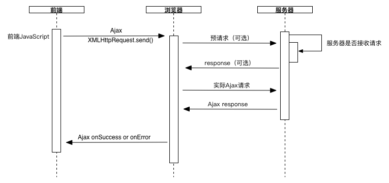

原文：http://blog.brucefeng.info/post/web-crossdomain-2016

*   [1\. JSONP](http://blog.brucefeng.info/post/web-crossdomain-2016#toc_0)
*   [2\. CORS（Cross-origin resource sharing）](http://blog.brucefeng.info/post/web-crossdomain-2016#toc_1)
    *   [2.1 运行模式](http://blog.brucefeng.info/post/web-crossdomain-2016#toc_2)
    *   [2.2 JQuery支持CORS](http://blog.brucefeng.info/post/web-crossdomain-2016#toc_3)
    *   [2.3 与JSONP相比](http://blog.brucefeng.info/post/web-crossdomain-2016#toc_4)
*   [3\. 跨域访问在点评的应用](http://blog.brucefeng.info/post/web-crossdomain-2016#toc_5)
*   [References](http://blog.brucefeng.info/post/web-crossdomain-2016#toc_6)

在互联网应用中：

*   一个页面需要请求多个域名下的web服务端接口
*   同时一个web服务接口可能会被很多不同域名下的页面请求。

一个web应用如果支持为了支持以上模式而申请多个域名是不合算的，因为域名申请和管理所占用的资源比较大，因此服务端支持跨域就成了一个更合理的解决方案。

解决跨域的方式主要有两种：

### 1\. JSONP

关于[JSONP的基本概念](https://zh.wikipedia.org/wiki/JSONP)就不多介绍了，现在在[网上已经有很多解释](https://www.google.com.hk/search?q=jsonp&ei=6GS5VraXHsO60ATcp7vAAQ&start=10&sa=N&biw=1280&bih=678&dpr=2)。JSONP模式下前端Client可以跨域请求JSON文件，进而实现前端跨域请求其他服务器资源的目的。
目前在一些流行的JavaScript库中对JSONP和Ajax的支持方式在表现形式上非常相近，在代码中写法几乎都是相同的，但是JSONP与Ajax是完全不同的原理。JSONP是以请求文件数据的方式向服务器发出请求，而Ajax是使用XMLHttpRequest向服务器异步发出请求。

*   优点
    JSONP并不需要浏览器特殊支持，可以说所有的浏览器都是支持JSONP请求的。而且目前各流行JavaScript类库对JSONP的支持已经很全面，开发中也比较方便。

*   缺点
    但JSONP的请求只能是GET请求，因为在请求URL有长度限制，一般情况下只要不超过2000字符都是可以的([What is the maximum length of a URL?](http://www.boutell.com/newfaq/misc/urllength.html))，主流浏览器所支持的长度也越来越放宽，基本是可以满足条件的。
    JSONP的web服务端接口因为无法限制接收指定域名的请求，因此在实际应用中需要在安全性方面进行更多限制，以避免接口数据泄漏。

### 2\. CORS（Cross-origin resource sharing）

主要是通过定义浏览器与服务器之间共享内容的方式来实现跨域。
CORS通过新增一系列 HTTP 头（Access-Control-Allow-Origin，Access-Control-Expose-Headers，Access-Control-Max-Age，Access-Control-Allow-Credentials，Access-Control-Allow-Methods，Access-Control-Allow-Headers等），让服务器能声明那些来源可以通过浏览器访问该服务器上的资源。另外，对那些会对服务器数据造成破坏性影响的 HTTP 请求方法（特别是 GET 以外的 HTTP 方法，或者搭配某些MIME类型的POST请求），标准强烈要求浏览器必须先以 OPTIONS 请求方式发送一个预请求(preflight request)，从而获知服务器端对跨源请求所支持 HTTP 方法。在确认服务器允许该跨源请求的情况下，以实际的 HTTP 请求方法发送那个真正的请求。服务器端也可以通知客户端，是不是需要随同请求一起发送信用信息（包括 Cookies 和 HTTP 认证相关数据）。

#### 2.1 运行模式



如果只使用简单请求向服务器发出请求，则浏览器就不需要向服务器发送预请求，服务器端只需要在response中增加Access-Control-Allow-Origin就可以了，开发非常简单，在代码上和Ajax请求几乎没有区别。

> 简单请求：只使用 GET, HEAD 或者 POST 请求方法。如果使用 POST 向服务器端传送数据，则数据类型(Content-Type)只能是 application/x-www-form-urlencoded, multipart/form-data 或 text/plain中的一种。不会使用自定义请求头（类似于 X-Modified 这种）。
> 但请求以如果 GET, HEAD 或者 POST 以外的方法发起请求。或者，使用 POST，但请求数据为 application/x-www-form-urlencoded, multipart/form-data 或者 text/plain 以外的数据类型。比如说，用 POST 发送数据类型为 application/xml 或者 text/xml 的 XML 数据的请求或者使用自定义请求头（比如添加诸如 X-PINGOTHER）时，浏览器就需要向服务器发送预请求，以确定服务器是否支持后续请求，如果支持，浏览器则继续发送后续Ajax请求。

#### 2.2 JQuery支持CORS
```javascript
$.ajax({
    //PUT 和DELETE  需要发送预请求
    type: 'HTTP METHOD',//如GET  ，POST  
    url: 'cross-domain-url',
    contentType:,
    xhrFields: {
      withCredentials: false
    },
    headers: {},
    success: function () {},
    error: function () {}
  });
```

详细的使用参见[HTTP访问控制(CORS)](https://developer.mozilla.org/zh-CN/docs/Web/HTTP/Access_control_CORS)。

#### 2.3 与JSONP相比

CORS的开发更为简单，对安全性的控制更为灵活，且目前所有的[现代浏览器都已经支持了CORS](http://caniuse.com/#feat=cors)模式，CORS支持所有的HTTP Method类型，在Restful请求中可以实现跨域。

### 3\. 跨域访问在点评的应用

在点评，很多功能采用[动静分离](http://blog.brucefeng.info/post/static-backend-asolate)的方式，在项目部署上也采用前端静态文件资源与后端web服务独立域名的方式进行；这种模式下，后端的HTTP 接口对于前端而言是一个服务接口；例如一个查询用户是否登录的接口，可能会被多个项目使用，因此就要求服务端接口支持跨域请求。
目前在点评中主要使用JSONP的方式来实现跨域请求；因为CORS算是一个新技术，因此还没有大规模使用，只会在一些不重要的功能中使用过。

### References

> [JSONP](https://zh.wikipedia.org/wiki/JSONP)
> [What is the maximum length of a URL?](http://www.boutell.com/newfaq/misc/urllength.html)
> [CORS（Cross-origin resource sharing）](https://en.wikipedia.org/wiki/Cross-origin_resource_sharing)
> [Cross-Origin Resource Sharing](https://www.w3.org/TR/cors/)
> [HTTP访问控制(CORS)](https://developer.mozilla.org/zh-CN/docs/Web/HTTP/Access_control_CORS)
> [JQuery CORS support IE's XDomainRequest object plugin](https://bugs.jquery.com/query?status=closed&resolution=plugin)