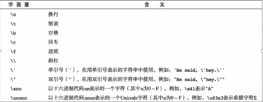
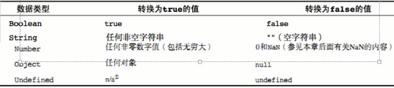

## 变量的定义
在javascript中定义变脸是通过关键字 `var`、`function` 定义的，在ES6中还可以用`let`、`const` 的方式定义变量
```javascript?linenums
var str = "hello world"; // 定义了一个值为“hello world”的String类型变量
var num = 10; // 定义了一个值为10的Number类型变量
var boolean = true; // 定义了一个值为true的Boolean类型变量
function (){ // 定义一个Function类型，名为fn的函数
  // 函数体
}
```
<!--more-->
## javascript变量命名规范
- 规则（必须遵守）
	- 由字母、数字、下划线、$组成
	- 不能是关键字和保留字
	- 区分大小写
- 规范（建议遵守）
	- 变量的名称要有意义
	- 变量的命名遵守驼峰命名法，首字母小写，第二个单词的首字母大写（eg：userName）

## 变量类型
### 基本数据类型
#### Number类型
- 整数
	- 十进制
	- 八进制
		1) 如果字面值中的数值超出了范围，那么前导零将被忽略，后面的数值将被当做十进制数值解析
	- 十六进制
- 浮点数
	- 小数
	- 科学计数法
	- 浮点数的最高精度是17位小数，但在进行算数计算时其精度远远不如整数
		- var  result = 0.1 + 0.2;//结果不等于0.3，而是0.300000000000000004
		- 永远不要测试某个特定的浮点数值（不要判断两个浮点数是否相等）
- 数值范围
	- 最小值：Number.MIN_VALUE，这个值为：5e-324
	- 最大值：Number.MAX_VALUE，这个值为：1.7976931348623157e+308
	- 无穷大：Infinity
	- 无穷小：-infinity
- 数值检测
	- NaN非数值（Not a Number）
		- NaN与任何值都不相等，包括自身
	- isNaN( 值 )：任何不能被转换为数值的值都会导致这个函数返回true

#### String类型
- 字符串字面量
- 字符串要用引号引起，单引号和双引号的作用是等效的
- 字符串是由一个个字符组成的，获取一个字符串的长度可以使用length属性
- 转义符

- 字符串的不可变---->其他类型重新赋值直接在内存上修改，字符串的修改要重新申请内存
	- ECMAScript中的字符串是不可变的，也就是说，字符串一旦创建，他们的值就不能改变
	- 要改变某个变量保存的字符串，需要重新开辟内存空间，然后修改变量的地址指向，之前的地址会被javascript垃圾回收机制不定时回收
	- 如果两个字符串变量值相同，则指向相同的内存地址
```javascript?linenums
var a = "hello";
var b = "hello";
console.log(a === b);   //true
```
	- 把字符串当做数组看的话，修改字符串的某个字符（按下标访问），并不能够修改该字符串，说明字符串不可变
	- 字符串类型是存储在堆内存中的
- 字符串拼接，字符串变量相加会把变量的值连接起来

#### Boolean类型
- false、true
- 区分大小写
- 虽然只有两个值，但是所有类型中都有有着两个值等价的值
- 其他类型转换为布尔值


#### Undefined类型
- 表示变量未赋值
- 只有一种值就是undefined
- undefined是Undefined类型的字面量

#### 类型转换
- 目标：掌握三种类型的转换
	- 转换成字符串类型
	- 转换成数值类型
	- 转换成布尔类型
- 转换成字符串类型
	- toString()方法——变量.toString()
		- 变量.toString()，转换成字符串
		- 数值类型的toString(进制数)--->将数值类型转换成几进制数值字符串
		- null和undefined没有toString()方法
- String()方法——String（变量）
		- 存在的意义：有些值没有toString()方法，这个时候可以用String()方法，比如undefined和null
	- 字符串拼接---> +
- 转换成数值类型
	- Number()：可以把任意值转换成数值，如果要转换的字符串中有一个不是数值的字符，返回NaN
		- 可以把true和false转换成 1和0 
		- 如果是空字符串，会转换成0
	- parseInt()：把字符串转换成整数
		- 会忽略前面的空格，直到找到第一个字符串为止，还会将后面的非数字字符串去掉 
			- "     123abc"会转换成123，
		- 如果第一个字符不是数字或者正负号，返回NaN
			- "abc123"会转换成NaN
			- "-123"会转换为-123
			 -"+123"会转换为123
		- 可以传递两个参数
			- 要转换的字符串
			- 第二个是要转换的数原先为几进制数，在2到36之间，如果该参数小于 2 或者大于 36，则 parseInt() 将返回 NaN。
	- parseFloat()：把字符串转换成浮点数
		- 转换方式与parseInt一样
	- parseInt()和parseFloat()的区别
		- parseFloat()会解析第一个，遇到第二个或者非数字结束
		- parseFloat()不支持第二个参数，只能解析10进制数
		- parseFloat()如果解析的内容里只有整数，解析成整数
			- 10.00会被解析成10
- 转换成布尔类型——Boolean（变量）
	- Boolean()方法
	- 流程控制语句会把后面的值隐式转换成布尔类型
	- “ ！ ”运算符
	- 转换成为false的值：false、""、0、和NaN、null、undefined
- 隐式转换
	- 转number
		- +、-、\*、/、%都会把变量转换成number类型
		- +号的隐式转换必须写在变量的前面：eg:   +"a"   、 +"undefined"、+"NaN"
	- 转string
		- var a = 123;  a = a + "";
	- 转boolean
		- var a = 123;  a = !a;

### 复杂数据类型
#### Object
#### Function
#### 
