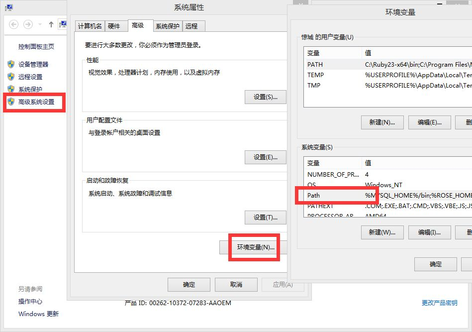

## 下载nodejs
打开[nodejs官网](https://nodejs.org/en/)，你会看到两个绿色的按钮，一个是目前大多数人在用的，一个是目前最新的版本，的需要下载即可，它会根据系统信息选择对应版本（.msi文件）。然后像安装QQ一样安装它就可以了（安装路径随意）
## 检测nodejs是否安装上了
打开命令提示符执行下列命令（打开方式：window + r 输入cmd回车）：
- node -v查看安装的nodejs版本，出现版本号，说明刚刚已正确安装nodejs。
- npm -v查看npm的版本号，npm是在安装nodejs时一同安装的nodejs包管理器。
- 如果输入命令后告诉你node不是内部命令，那么请看下步配置环境变量
- 如果上述都能正常执行，恭喜你，安装成功了

<!-- more -->

## 配置环境变量
- 找到nodejs的安装目录，拷贝路径地址，默认是（C:\Program Files\nodejs）
- 找到桌面我的电脑图标，右键点击属性菜单弹出系统面板
- 点击系统面板的高级系统设置，弹出系统属性面板
- 点击属性面板的环境变量按钮，弹出环境变量面板
- 找到系统变量的path，双击，将nodejs的bin目录url添加到后面即可
*注意*：在添加的时候确保前面有一个英文的分号

![enter description here][1]
- 配置完之后继续输入命令，查看node和npm的版本
## npm介绍
[npm官网](https://www.npmjs.com/)
- 说明：npm（node package manager）nodejs的包管理器，用于node插件管理（包括安装、卸载、管理依赖等）；
- 使用npm安装插件：命令提示符执行`npm install <name> [-g] [--save-dev]`；
	- &lt;name&gt;：node插件名称。例：`npm install gulp-less --save-dev`
		- `-g`：全局安装。将会安装C:\Users\Administrator\AppData\Roaming\npm，并且写入系统环境变量；  非全局安装：将会安装在当前定位目录；  全局安装可以通过命令行在任何地方调用它，本地安装将安装在定位目录的`node_modules`文件夹下，通过`require()`调用；
	- `--save`：将保存配置信息至package.json（package.json是nodejs项目配置文件）；
	- `-dev`：保存至package.json的devDependencies节点，不指定-dev将保存至dependencies节点；一般保存在dependencies的像这些express/ejs/body-parser等等。
	- 为什么要保存至package.json？因为node插件包相对来说非常庞大，所以不加入版本管理，将配置信息写入package.json并将其加入版本管理，其他开发者对应下载即可（命令提示符执行npm install，则会根据package.json下载所有需要的包，`npm install --production` 只下载dependencies节点的包）。
- 使用npm卸载插件：`npm uninstall <name> [-g] [--save-dev]`  **PS：不要直接删除本地插件包**
	- 删除全部插件：`npm uninstall gulp-less gulp-uglify gulp-concat` ……???太麻烦，请看下一个
	- 借助rimraf：`npm install rimraf -g` 用法：`rimraf node_modules`
- 使用npm更新插件：`npm update <name> [-g] [--save-dev]`
	- 更新全部插件：`npm update [--save-dev]`
- 查看npm帮助：`npm help`
- 当前目录已安装插件：`npm list`
**PS：npm安装插件过程：从 http://registry.npmjs.org 下载对应的插件包（该网站服务器位于国外，所以经常下载缓慢或出现异常），解决办法往下看↓↓↓↓↓↓。**

## 选装cnpm
- 说明：因为npm安装插件是从国外服务器下载，受网络影响大，可能出现异常，如果npm的服务器在中国就好了，所以我们乐于分享的淘宝团队干了这事。32个赞！来自官网：“这是一个完整 [npmjs.org](http://npmjs.org/) 镜像，你可以用此代替官方版本(只读)，同步频率目前为 10分钟 一次以保证尽量与官方服务同步。”；
- 官方网址：http://npm.taobao.org；
- 安装：命令提示符执行`npm install cnpm -g --registry=https://registry.npm.taobao.org`；  注意：安装完后最好查看其版本号 `cnpm -v` 或关闭命令提示符重新打开，安装完直接使用有可能会出现错误；
**注：cnpm跟npm用法完全一致，只是在执行命令时将npm改为cnpm（以下操作将以cnpm代替npm）。**
